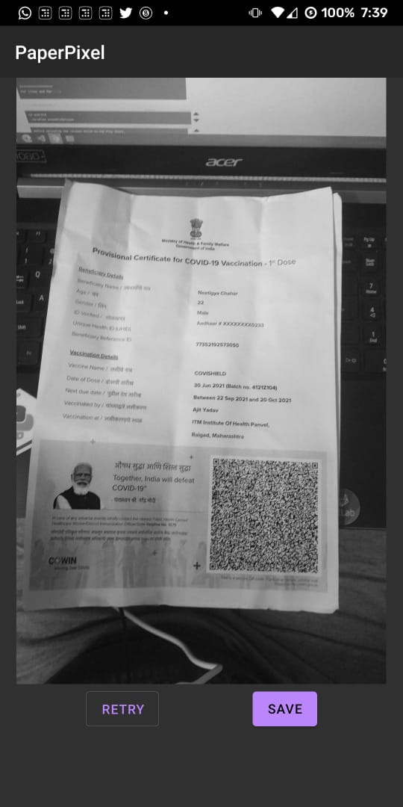
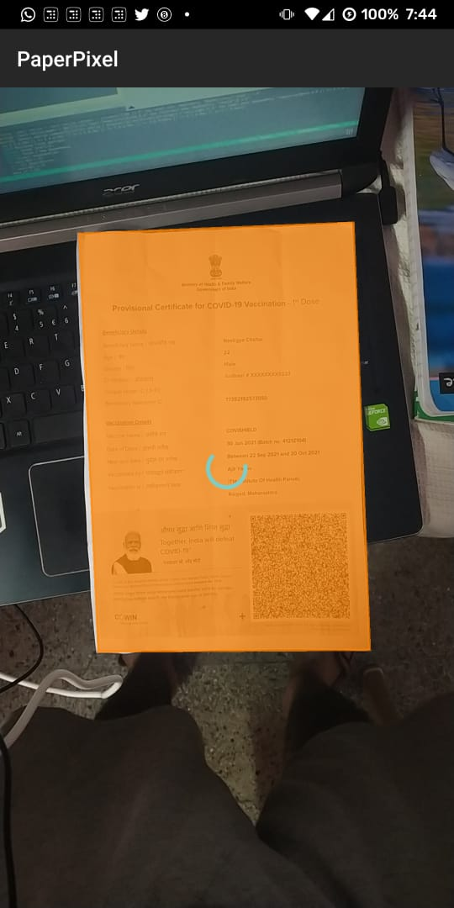
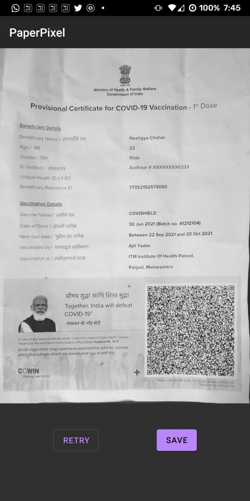
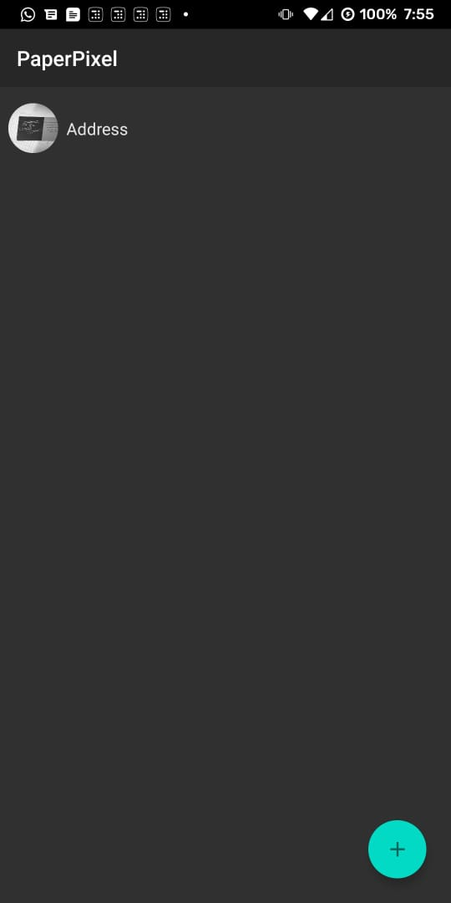

# PaperPixel

Scan docs and save the scans locally

## Screenshots
- Start capturing

- Detects the doc

- Scans and clicks the picture

- Adds to the list (pic from another scan)

## Run locally
- Download dependencies - `yarn install`
- Run Metro - `npx react-native start`
- Connect physical device
- Run project for android/ios - `npx react-native run-android` or `npx react-native run-ios`